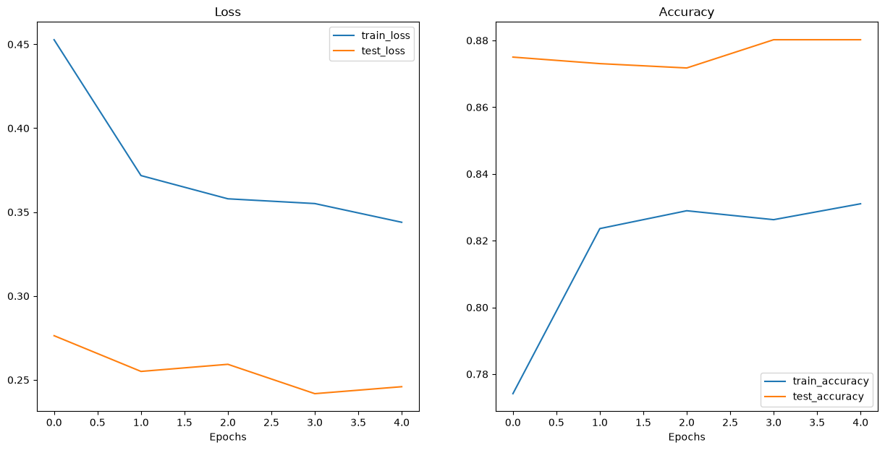

# 🫁 Pneumonia Detection Model

A convolutional neural network (CNN) that classifies chest X-ray images as **Normal** or **Pneumonia**, served through an interactive Streamlit dashboard.


---

## Overview

This project trains a lightweight CNN (**TinyVGG** architecture) on chest X-ray images to detect signs of pneumonia. The trained model is deployed via a Streamlit web app that allows users to upload an X-ray and receive an instant Normal / Pneumonia prediction with confidence scores.

> ⚠️ **Disclaimer:** This is an educational/portfolio project trained on a public dataset. It is **not** a certified diagnostic tool and must not be used for real medical decisions.

---

## Dataset

Sourced from Kaggle: [Chest X-Ray Dataset](https://www.kaggle.com/datasets/muhammadrehan00/chest-xray-dataset)

| Split | Normal | Pneumonia |
|-------|-------:|----------:|
| Train | 7,263  | 4,674     |
| Val   | 900    | 570       |
| Test  | 925    | 580       |

Images are organized by class folder (`normal/`, `pneumonia/`) and loaded with `torchvision.datasets.ImageFolder`. The original dataset also includes a `tuberculosis` class, which is filtered out to keep this a binary Normal-vs-Pneumonia classifier.

---

## Model Architecture

**TinyVGG** — a compact CNN:

- 2× convolutional blocks (Conv → ReLU → Conv → ReLU → MaxPool)
- Fully connected classifier head
- Input size: 64×64 RGB
- Output: 2 classes (Normal, Pneumonia)

---

## Training Results

<p align="center">
  
</p>

| Metric | Train | Test |
|--------|------:|-----:|
| Final Loss | ~0.34 | ~0.24 |
| Final Accuracy | ~83% | ~88% |

Test accuracy tracks above train accuracy with both curves stabilizing, indicating no significant overfitting over the training run.

---

## Project Structure

```
Pneumonia Detection Model/
├── Dataset/
│   └── archive_2/
│       ├── train/
│       ├── val/
│       └── test/
├── models/
│   └── pneumonia_model.pth
├── assets/
│   └── training_curves.png
├── src/ or notebook
│   └── train_fixed.ipynb
├── app.py
├── requirements.txt
└── README.md
```

---

## Setup

```bash
git clone <your-repo-url>
cd "Pneumonia Detection Model"
pip install -r requirements.txt
```

### Train the model

Run through `train_fixed.ipynb` top to bottom. This will:
1. Load and preprocess the dataset
2. Train the TinyVGG CNN
3. Save weights to `models/pneumonia_model.pth`

### Run the app

```bash
python -m streamlit run app.py
```

Then open `http://localhost:8501` in your browser.

---

## Usage

1. Launch the Streamlit app
2. Upload a chest X-ray image (JPG/PNG)
3. View the prediction — **Normal** or **Pneumonia** — with confidence breakdown

---

## Tech Stack

- **PyTorch** — model training and inference
- **Torchvision** — dataset loading and image transforms
- **Streamlit** — web dashboard
- **PIL / Matplotlib** — image handling and result visualization

---

## License

MIT License — free to use and modify for educational purposes.
